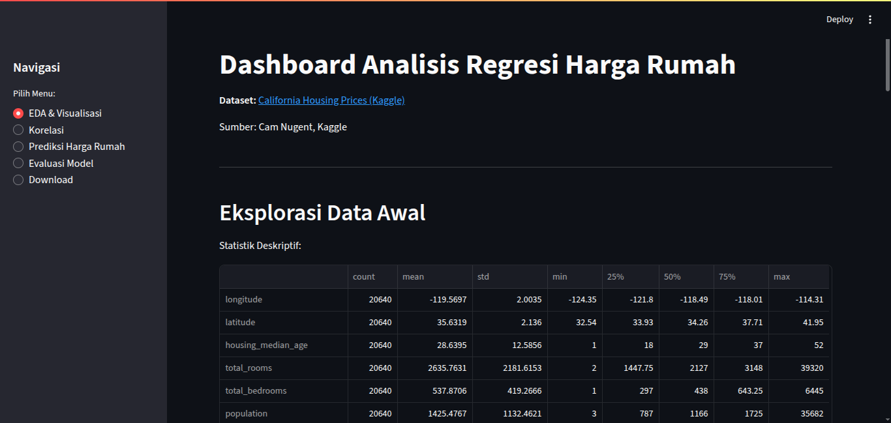
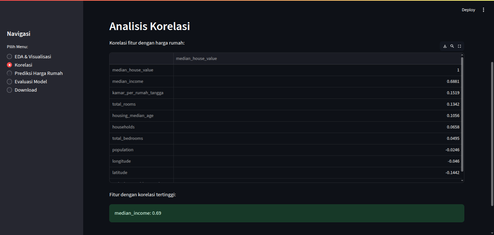
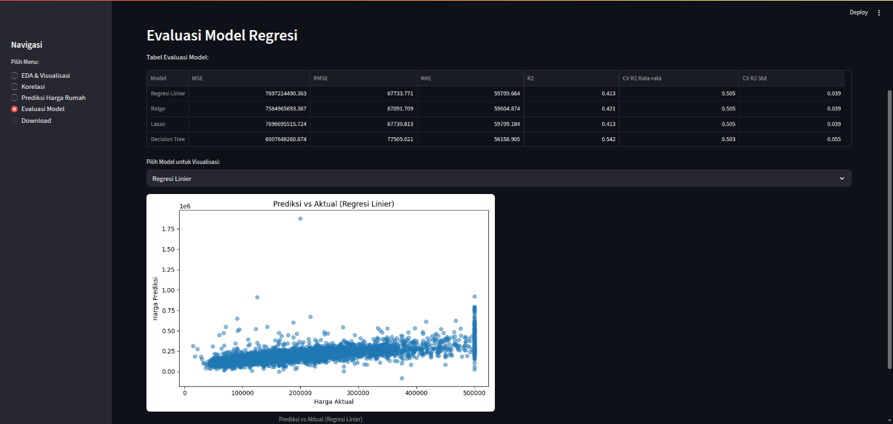
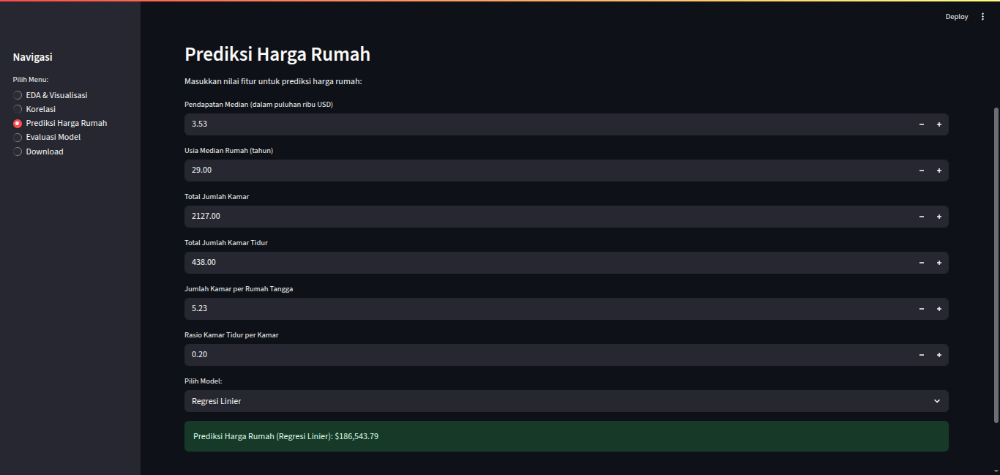

# Analisis Regresi Harga Rumah California

## Anggota Kelompok
- Ahmad Natsrul Ulum (23.11.5524)
- Zulfa Meydita Rahma (23.11.5512)

## Deskripsi Proyek
Proyek ini melakukan analisis regresi linier sederhana dan berganda pada dataset harga rumah di California. Analisis meliputi eksplorasi data, visualisasi, rekayasa fitur, pembuatan model regresi, evaluasi model, serta pembuatan dashboard interaktif dan poster otomatis.

## Sumber Data
Dataset: [California Housing Prices (Kaggle, Cam Nugent)](https://www.kaggle.com/datasets/camnugent/california-housing-prices)

## Fitur yang Digunakan
- median_income
- housing_median_age
- total_rooms
- total_bedrooms
- kamar_per_rumah_tangga (rekayasa fitur)
- rasio_kamar_tidur_per_kamar (rekayasa fitur)

## Hasil Analisis
- Statistik deskriptif dan visualisasi (histogram, scatter plot, heatmap)
- Analisis korelasi fitur dengan harga rumah
- Model regresi linier sederhana & berganda, Ridge, Lasso, Decision Tree
- Evaluasi model (MSE, RMSE, MAE, R2, cross-validation)
- Dashboard interaktif (Streamlit)
- Poster otomatis (.png)
- Dataset bersih (.csv)

## Tampilan Dashboard
Berikut adalah beberapa tampilan dari dashboard interaktif yang dibangun menggunakan Streamlit:

### 1. Halaman Utama Dashboard

*Dashboard utama menampilkan ringkasan analisis, visualisasi, dan navigasi ke fitur-fitur utama.*

### 2. Analisis Korelasi

*Visualisasi heatmap korelasi antar fitur dan harga rumah.*

### 3. Evaluasi Model Regresi

*Perbandingan performa model regresi menggunakan metrik evaluasi.*

### 4. Prediksi Harga Rumah

*Visualisasi hasil prediksi harga rumah vs nilai aktual.*

## Cara Menjalankan
1. **Buat virtual environment (opsional, direkomendasikan)**
   - **Linux/Mac:**
     ```bash
     python3 -m venv env
     source env/bin/activate
     ```
   - **Windows:**
     ```cmd
     python -m venv env
     .\env\Scripts\activate
     ```
2. **Install dependensi**
   ```bash
   pip install -r requirements.txt
   ```
3. **Jalankan analisis & generate output**
   ```bash
   python analysis.py
   ```
   - Akan menghasilkan: `housing_clean.csv`, visualisasi (.png), dan poster otomatis.
4. **Jalankan dashboard**
   ```bash
   streamlit run app.py
   ```
   - Dashboard dapat diakses di browser pada http://localhost:8501

## Struktur File
- `analysis.py` : Script analisis, visualisasi, model, dan poster
- `app.py` : Dashboard interaktif Streamlit
- `requirements.txt` : Daftar dependensi Python
- `housing_clean.csv` : Dataset bersih hasil cleaning & rekayasa fitur
- `poster_regresi_housing.png` : Poster otomatis hasil analisis
- `viz_*.png` : File visualisasi otomatis
- `.gitignore` : File/folder yang diabaikan git

## Catatan
- Semua output (dashboard, poster, dataset bersih) dihasilkan otomatis dari script.